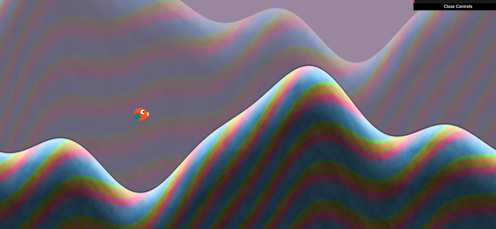

# TinyWings

Isabela Rovira and Wenli Zhao, April 2018
-------------------------

Introduction
======================

Over the course of the semester, we have been able to explore a variety of procedural techniques for generating computer graphics. For our final project, we wanted to apply the techniques we learned towards making a cohesive, engaging, and interactive experience. What better way to do that than a game?

We want to explore 2D graphics by recreating Tiny Wings for WebGL. We will be implementing all core elements of the gameplay along with the procedural techniques for level generation.

Inspiration
------------
Tiny Wings

Techniques
------------
* 2D Rendering System: Terrain (Wenli), Bird (Isabela)

* Perlin noise for texturing the background and sky (Wenli)
* Randomization of color palette (Wenli)
* Parallax and Camera Movement (Wenli)
* Game Physics (Isabela)
* Game Logic and Interaction (Isabela)


Classes

--------------
* GameManager (GameManager.ts)
* Player (Player.ts)
* Game Vertex Shader (game-vert.glsl)
* Game Frag Shader (game-frag.glsl)

References and Inspiration
--------------

[ShaderToy TinyWings Inspired Landscape](https://www.shadertoy.com/view/lscGzB)
[Parallax Scrolling](https://gamedevelopment.tutsplus.com/tutorials/parallax-scrolling-a-simple-effective-way-to-add-depth-to-a-2d-game--cms-21510)
[Framework Reference](https://github.com/haqu/tiny-wings)
[Texture Generation Tutorial](https://www.raywenderlich.com/33266/how-to-create-dynamic-textures-with-ccrendertexture-in-cocos2d-2-x)
