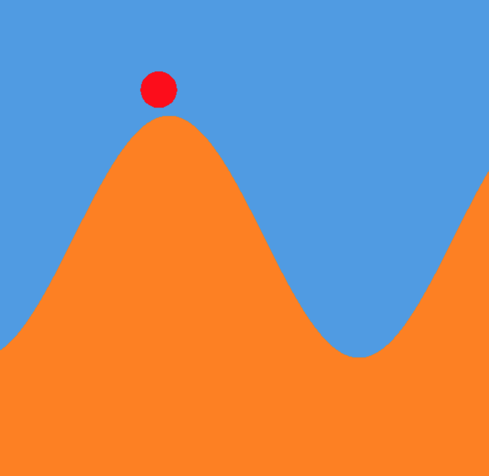
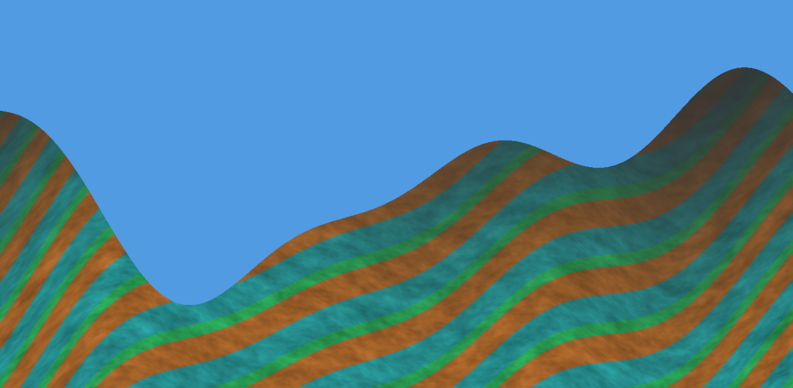

# TinyWings

Midpoint Progress (4/17/18)
======================

Isabela Rovira
------------
My goals for this milestone were to implement the game framework classes, including Player.ts and GameManager.ts.
Instead of working on terrain generation, I decided to handle game physics. Most of my time was spent figuring out player/terrain intersections.

Wenli Zhao
----------
My goals for this milestone were to create the side scrolling camera and rendering framework as well as working on procedural texture generation. I ended up working on procedural terrain height generation as well just because it made more sense for me to do both parts related to the terrain. I wrote most of the terrain.ts class. I also wrote a shader that will render continuously scrolling terrain based on the position of the player. (game-frag.glsl) The height generation is a composition of sinusoidal functions. The wavy texture is created from rotating the height and mapping different colors to different stripes along with a gradient and perlin noise to add texture. I'm still in the process of making it look better.

